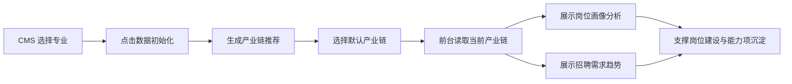

# V1.0 一期范围说明

## 一期目标

V1.0 一期先把“专业初始化 -> 产业链选择 -> 岗位画像分析 -> 招聘需求趋势”的基础链路跑通。它不追求一次性完成岗位中心、产业调研、课程模型、成果展示的全部能力，而是优先建立后续模块依赖的数据底座。

本期完成后，系统应能回答三个基础问题：

- 当前专业的岗位分析依据从哪里初始化。
- 当前专业优先对接哪条产业链。
- 该产业链下有哪些重点岗位、岗位能力、证书、招聘趋势和技能热度。

## 本期模块

| 模块 | 业务定位 | 关键用户 | 当前 demo 入口 |
| --- | --- | --- | --- |
| CMS 数据初始化 | 为专业开通产业调研与岗位分析数据底座 | 平台管理员 / CMS 运营 | `industry-research-admin.html` |
| 岗位画像分析 | 拆解岗位的任务、能力、证书、企业和专业关联 | 专业负责人 / 教研人员 | 岗位中心 > 岗位分析 > 岗位画像分析 |
| 招聘需求趋势 | 判断岗位建设优先级和能力热度 | 专业负责人 / 教研人员 | 岗位中心 > 岗位分析 > 招聘需求趋势 |

## 业务闭环

## 本期不做

- 不做“新岗位新技术预判”的完整生产化，只保留后续扩展入口。
- 不做完整产业调研报告生成。
- 不做课程模型、课程能力矩阵和培养方案治理。
- 不做复杂爬虫调度平台；岗位与招聘数据先以导入、后台初始化或人工维护数据为主。
- 不做跨专业、跨院校的大规模对标。
- 不做全量权限体系，只保留必要的管理端与前台角色边界。

## 一期成功标准

- 管理端可以看到未初始化、初始化中、已初始化三类状态。
- 管理端初始化后可展示推荐产业链，支持选择默认产业链。
- 前台岗位画像分析能按当前产业链展示岗位卡片、筛选搜索、画像详情。
- 前台招聘需求趋势能展示 KPI、月度趋势、技能热度和岗位明细。
- 三个模块的数据对象能沉淀到后续岗位建设中心复用。
