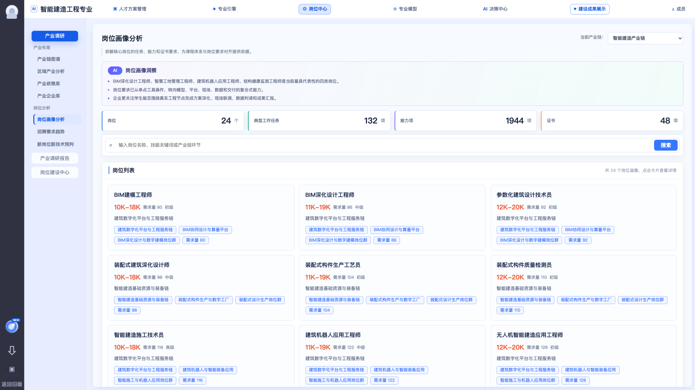
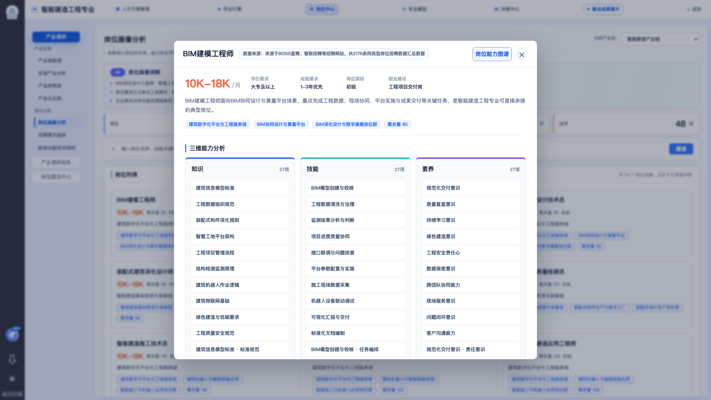

# 岗位画像分析

## 模块定位

岗位画像分析用于把产业链下的重点岗位拆解成可理解、可检索、可沉淀的岗位画像。它是前台岗位中心的核心分析页面，也是后续岗位建设、能力项维护、课程关联和报告生成的基础输入。

截图参考：

## 用户角色

- 专业负责人：查看当前专业应重点建设的岗位群。
- 教研人员：查看岗位任务、能力、证书和课程改造依据。
- 平台运营：检查岗位画像数据是否已初始化、是否可用于演示和交付。

## 页面结构

### 1. 顶部说明区

展示当前页面标题、模块说明和当前产业链。

需求点：

- 显示模块标题“岗位画像分析”。
- 显示说明文案：拆解核心岗位的任务、能力和证书要求，为课程体系与岗位要求对齐提供依据。
- 显示当前产业链，例如“智能建造产业链”。
- 当前产业链来自 CMS 初始化后的默认选择。

### 2. AI 洞察区

展示岗位画像洞察摘要。

需求点：

- 展示 3-4 条洞察结论。
- 洞察应覆盖重点岗位、能力特征、企业关注点、课程建设建议。
- 支持后续从规则模板或 AI 生成结果替换静态文案。

### 3. KPI 指标区

当前 demo 指标包括：

| 指标 | 含义 |
| --- | --- |
| 岗位 | 当前产业链下岗位画像数量 |
| 典型工作任务 | 所有岗位典型任务数量汇总 |
| 能力项 | 岗位知识、技能、素养能力项汇总 |
| 证书 | 岗位关联证书数量汇总 |

需求点：

- KPI 由岗位画像明细数据实时汇总。
- 当搜索或筛选改变时，岗位列表数量跟随变化；KPI 是否跟随筛选需要产品确认，建议一期先展示全量汇总。

### 4. 搜索与筛选

需求点：

- 支持按岗位名称搜索。
- 支持按技能关键词搜索。
- 支持按产业链环节搜索。
- 支持按岗位等级筛选：全部、初级、中级、高级。
- 搜索无结果时显示空状态提示。

### 5. 岗位卡片列表

每个岗位卡片展示：

- 岗位名称
- 薪资区间
- 需求量
- 岗位等级
- 所属产业链环节
- 主要能力标签

交互需求：

- 点击岗位卡片打开岗位画像详情。
- 支持分页，当前 demo 每页展示 12 个岗位。
- 卡片应能承接后续“加入岗位建设中心”或“生成岗位能力图谱”的扩展入口，但一期不强制实现。

### 6. 岗位画像详情弹窗

详情弹窗展示单个岗位的完整画像。

字段需求：

| 分组 | 字段 |
| --- | --- |
| 基本信息 | 岗位名称、薪资、学历、经验、岗位等级、需求量、职业发展路径 |
| 产业关系 | 所属产业链、产业环节、岗位标签 |
| 岗位说明 | 岗位摘要、典型工作任务 |
| 能力要求 | 知识、技能、素养三类能力项 |
| 能力雷达 | 知识基础、工程实践、工具平台、业务场景、交付协作 |
| 证书 | 证书名称、等级 |
| 专业关联 | 关联专业或专业方向 |
| 企业样本 | 企业名称、行业、地区、标签 |

交互需求：

- 支持关闭弹窗。
- 支持查看证书详情，作为后续扩展。
- 支持查看企业详情，作为后续扩展。
- 一期详情以可读展示为主，不做复杂编辑。

## 数据来源

当前 demo 来源：

- `src/mock/job-research.ts`
- `src/mock/job-center.ts`

生产化建议：

- 岗位画像基础数据由 CMS 初始化、岗位数据导入或人工维护产生。
- 岗位能力项应与岗位建设中心能力库保持同名，避免后续图谱连线断链。
- 岗位需求量和薪资可来自招聘数据汇总，也可先作为运营维护字段。

## 验收标准

- 进入岗位画像分析页后，能看到 AI 洞察、4 个 KPI、搜索框和岗位列表。
- 搜索岗位名称、技能关键词或产业链环节后，列表能正确过滤。
- 按岗位等级筛选后，列表和分页状态正确。
- 点击岗位卡片能打开详情弹窗。
- 详情弹窗至少展示基本信息、能力项、典型任务、证书、专业关联和企业样本。
- 当前产业链切换后，岗位画像数据可按默认产业链加载。

## 风险点

- 岗位数据来源不一致会导致岗位名称、能力项和招聘趋势无法对应。
- 能力项命名不统一会影响后续课程映射和岗位能力图谱。
- 如果岗位画像详情字段一次性做太深，容易拖慢一期交付，建议先做展示闭环，再做编辑维护。
