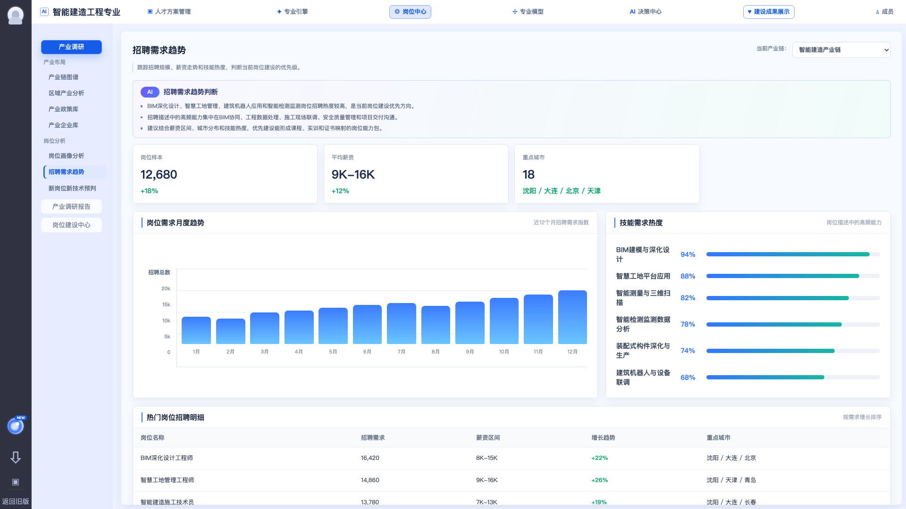

# 招聘需求趋势

## 模块定位

招聘需求趋势用于展示当前产业链下岗位招聘规模、薪资水平、增长变化、技能热度和重点城市分布，帮助专业负责人判断岗位建设优先级。

截图参考：

## 用户角色

- 专业负责人：判断哪些岗位应优先进入岗位建设。
- 教研人员：识别高频技能与课程调整方向。
- 平台运营：维护或导入招聘统计数据。

## 页面结构

### 1. 顶部说明区

需求点：

- 标题显示“招聘需求趋势”。
- 说明文案：跟踪招聘规模、薪资走势和技能热度，判断当前岗位建设的优先级。
- 当前产业链应与岗位画像分析保持一致。

### 2. AI 趋势判断

展示 3 条左右趋势判断。

建议内容：

- 哪些岗位招聘热度较高。
- 招聘描述中高频能力集中在哪些方向。
- 应优先建设哪些能形成课程、实训和证书映射的岗位能力包。

### 3. KPI 指标区

当前 demo 指标包括：

| 指标 | 含义 |
| --- | --- |
| 近12月岗位需求 | 当前产业链下岗位招聘总量 |
| 高频招聘岗位 | 招聘热度较高的岗位数量 |
| 平均薪资 | 统计样本中的平均薪资 |
| 企业样本 | 纳入统计的企业数量 |

需求点：

- 每个 KPI 展示当前值和趋势变化。
- 趋势变化支持百分比或新增数量。
- 一期可先用月度汇总数据，不要求实时招聘平台爬取。

### 4. 岗位需求月度趋势

图表需求：

- 展示近 12 个月招聘需求指数或招聘数量。
- 横轴按月份展示。
- 纵轴展示招聘总数或指数。
- 支持后续扩展为按岗位、地区、学历、薪资区间筛选。

一期建议：

- 先实现全产业链月度趋势。
- 不做复杂多岗位叠加图。
- 图表数据按后端返回结构渲染。

### 5. 技能需求热度

需求点：

- 展示招聘描述中的高频能力项。
- 每个技能展示热度百分比或指数。
- 能力项名称要尽量与岗位画像能力项、岗位建设中心能力库一致。

当前 demo 示例：

- BIM 建模与深化设计
- 智慧工地平台应用
- 智能测量与三维扫描
- 智能检测监测数据分析
- 装配式构件深化与生产
- 建筑机器人与设备联调

### 6. 热门岗位招聘明细

字段需求：

| 字段 | 说明 |
| --- | --- |
| 岗位名称 | 热门招聘岗位 |
| 招聘需求 | 招聘数量或需求指数 |
| 薪资区间 | 岗位薪资范围 |
| 增长趋势 | 同比、环比或近阶段增长 |
| 重点城市 | 招聘集中城市 |

需求点：

- 默认按需求增长或招聘数量排序。
- 一期可先只做展示，不做表格高级筛选。
- 岗位名称应能与岗位画像列表中的岗位匹配，后续可跳转画像详情。

## 数据来源

当前 demo 来源：

- `src/mock/job-research.ts` 中的 `DEMAND_KPIS`
- `DEMAND_TREND`
- `DEMAND_SKILL_BARS`
- `DEMAND_JOB_ROWS`

生产化建议：

- 招聘数据以“采集批次”为单位沉淀，避免每次刷新导致口径变化。
- 月度趋势需要记录统计周期、岗位口径、城市范围、样本来源。
- 技能热度应保留原始招聘文本关键词与标准能力项之间的映射关系。

## 验收标准

- 页面能展示 KPI、月度趋势图、技能热度和热门岗位明细。
- KPI 与趋势图、明细表使用同一个产业链上下文。
- 技能热度中的能力项可与岗位画像能力项建立对应。
- 热门岗位明细的岗位名称可在岗位画像分析中找到对应岗位，或明确标记为待建设岗位。
- 无招聘数据时显示空状态，不展示误导性默认结论。

## 风险点

- 招聘数据口径如果不固定，趋势判断容易被质疑。
- 只展示数量不展示样本来源，会影响评审可信度。
- 技能关键词如果不做标准化，后续难以支撑课程和能力项映射。
