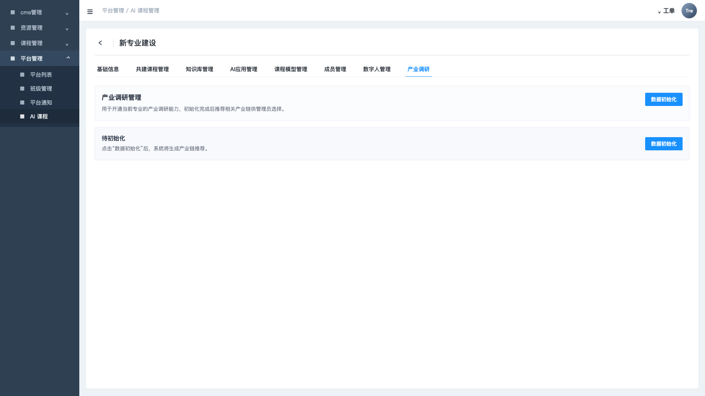
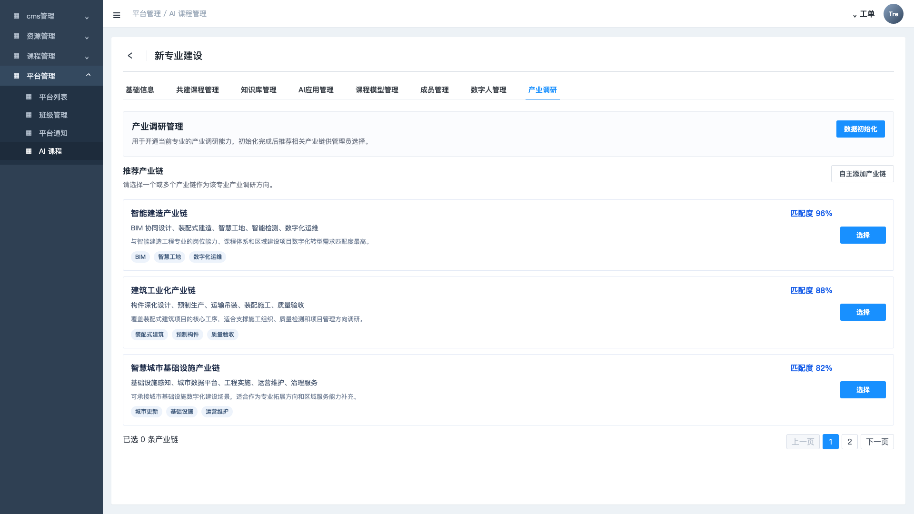
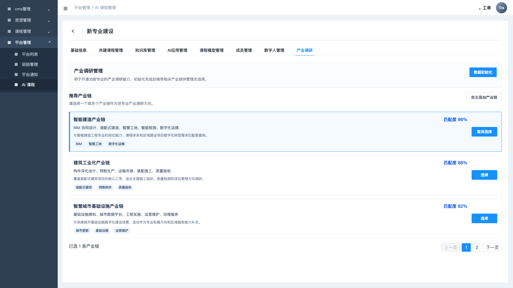
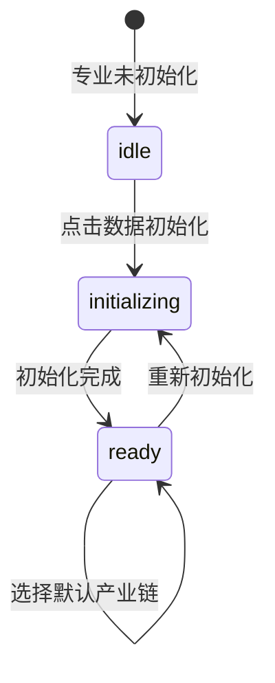

# CMS 数据初始化

## 模块定位

CMS 数据初始化用于在管理端为某个专业开通产业调研和岗位分析的数据基础。初始化完成后，系统推荐相关产业链，管理员选择默认产业链，前台岗位画像分析和招聘需求趋势据此加载数据。

截图参考：

## 用户角色

- 平台管理员：为专业开通产业调研和岗位分析能力。
- 内容运营：维护推荐产业链、初始化结果和默认产业链。
- 专业建设项目管理员：确认当前专业使用哪条产业链作为分析主线。

## 页面入口

当前 demo 入口：

- `industry-research-admin.html`
- 页面名称：新专业建设 > 产业调研管理

## 状态流转

## 页面结构

### 1. 专业建设管理页

需求点：

- 显示 CMS 侧导航和“新专业建设”标题。
- 显示专业建设相关 Tab。
- 当前一期只要求产业调研管理 Tab 可用。

### 2. 初始化操作区

未初始化状态：

- 显示“待初始化”空状态。
- 显示说明：点击“数据初始化”后，系统将根据专业基础信息、培养方向、岗位资料与已有建设数据生成产业链推荐。
- 显示主按钮“数据初始化”。

初始化中状态：

- 显示“初始化中”。
- 显示进度条或加载状态。
- 显示说明：正在识别专业服务面向、岗位能力关键词、课程支撑关系和区域产业关联。

已初始化状态：

- 显示推荐产业链列表。
- 按匹配度、产业链阶段说明、推荐理由、证据标签展示。
- 操作按钮变为“重新初始化”。

### 3. 推荐产业链列表

字段需求：

| 字段 | 说明 |
| --- | --- |
| 产业链 ID | 系统内部标识 |
| 产业链名称 | 例如智能建造产业链 |
| 匹配度 | 专业与产业链的匹配分 |
| 阶段摘要 | 产业链关键环节摘要 |
| 推荐理由 | 为什么推荐该产业链 |
| 证据标签 | BIM、智慧工地、数字化运维等 |
| 是否选中 | 是否作为专业默认产业链 |

交互需求：

- 支持选择一个产业链作为默认产业链。
- 支持取消或更换选择。
- 支持分页，当前 demo 推荐列表每页展示若干条。
- 支持“自主添加产业链”入口，但一期可先作为占位能力。

## 初始化输入

一期建议输入：

- 专业名称
- 专业代码
- 专业群
- 培养方向
- 已有岗位资料
- 已有课程资料
- 已有建设数据
- 所属学校或项目空间

## 初始化输出

一期建议输出：

- 推荐产业链列表
- 默认产业链
- 岗位画像候选数据
- 招聘趋势统计数据
- 技能关键词与标准能力项映射
- 初始化批次号、初始化时间、操作人

## 数据来源

当前 demo 来源：

- `src/app/industry-research-management.ts` 中的 `INDUSTRY_RESEARCH_CHAIN_RECOMMENDATIONS`
- `src/App.vue` 中的初始化状态、分页、选择逻辑

生产化建议：

- 初始化结果需要落库，不应只存在前端状态。
- 默认产业链需要被前台岗位分析模块读取。
- 重新初始化应生成新批次，保留历史批次便于追溯。

## 验收标准

- 未初始化专业进入 CMS 页面时，显示待初始化状态。
- 点击数据初始化后，进入初始化中状态。
- 初始化完成后展示产业链推荐列表。
- 管理员可以选择一个默认产业链。
- 已选择的默认产业链能被前台岗位画像分析和招聘需求趋势读取。
- 重新初始化不会直接丢失历史选择，至少要有确认或批次记录。

## 风险点

- 如果初始化结果不落库，前台和 CMS 容易出现状态不一致。
- 如果默认产业链没有统一配置入口，岗位画像和招聘趋势会各自使用不同产业链。
- 如果重新初始化覆盖旧数据，评审和交付时难以追溯数据来源。
