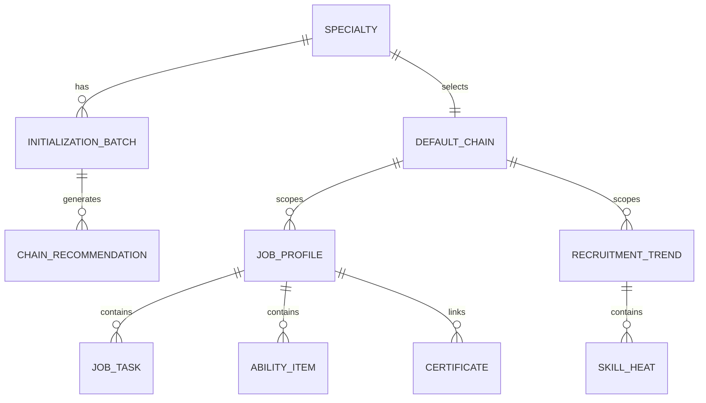

# 数据对象与接口拆解

## 总体数据关系

## 核心对象

### 1. 专业对象 Specialty

| 字段 | 类型 | 说明 |
| --- | --- | --- |
| id | string | 专业 ID |
| name | string | 专业名称 |
| code | string | 专业代码 |
| groupName | string | 专业群 |
| schoolId | string | 学校或租户 ID |
| buildStatus | enum | 未初始化、初始化中、已初始化 |

### 2. 初始化批次 InitializationBatch

| 字段 | 类型 | 说明 |
| --- | --- | --- |
| id | string | 初始化批次 ID |
| specialtyId | string | 专业 ID |
| status | enum | idle、initializing、ready、failed |
| sourceSummary | object | 输入资料摘要 |
| createdBy | string | 操作人 |
| createdAt | datetime | 创建时间 |
| completedAt | datetime | 完成时间 |
| errorMessage | string | 失败原因 |

### 3. 产业链推荐 ChainRecommendation

| 字段 | 类型 | 说明 |
| --- | --- | --- |
| id | string | 推荐记录 ID |
| batchId | string | 初始化批次 ID |
| chainId | string | 产业链 ID |
| name | string | 产业链名称 |
| matchScore | number | 匹配度 |
| stageSummary | string | 阶段摘要 |
| reason | string | 推荐理由 |
| evidenceTags | string[] | 证据标签 |
| selected | boolean | 是否选中 |

### 4. 岗位画像 JobProfile

| 字段 | 类型 | 说明 |
| --- | --- | --- |
| id | string | 岗位 ID |
| specialtyId | string | 专业 ID |
| chainId | string | 产业链 ID |
| name | string | 岗位名称 |
| salaryRange | string | 薪资区间 |
| education | string | 学历要求 |
| experience | string | 经验要求 |
| level | enum | 初级、中级、高级 |
| demandVolume | string | 需求量 |
| careerPath | string | 职业发展路径 |
| summary | string | 岗位摘要 |
| industryNode | string | 产业环节 |
| tags | string[] | 岗位标签 |

### 5. 岗位能力 AbilityItem

| 字段 | 类型 | 说明 |
| --- | --- | --- |
| id | string | 能力项 ID |
| jobId | string | 岗位 ID |
| name | string | 能力项名称 |
| category | enum | 知识、技能、素养 |
| score | number | 能力强度或权重 |
| normalizedName | string | 标准化能力项名称 |

### 6. 招聘趋势 RecruitmentTrend

| 字段 | 类型 | 说明 |
| --- | --- | --- |
| id | string | 趋势记录 ID |
| specialtyId | string | 专业 ID |
| chainId | string | 产业链 ID |
| period | string | 统计周期 |
| totalDemand | number | 招聘总量 |
| averageSalary | string | 平均薪资 |
| companySampleCount | number | 企业样本数 |
| highFrequencyJobCount | number | 高频岗位数 |

### 7. 招聘月度趋势 RecruitmentTrendMonth

| 字段 | 类型 | 说明 |
| --- | --- | --- |
| trendId | string | 趋势记录 ID |
| month | string | 月份 |
| value | number | 招聘数量或指数 |

### 8. 技能热度 SkillHeat

| 字段 | 类型 | 说明 |
| --- | --- | --- |
| trendId | string | 趋势记录 ID |
| skillName | string | 技能名称 |
| heat | number | 热度指数 |
| abilityItemId | string | 对应标准能力项 ID |

## 接口建议

### CMS 数据初始化

| 接口 | 方法 | 用途 |
| --- | --- | --- |
| `/api/specialties/{id}/industry-init/status` | GET | 查询初始化状态 |
| `/api/specialties/{id}/industry-init` | POST | 发起数据初始化 |
| `/api/specialties/{id}/industry-init/recommendations` | GET | 查询推荐产业链 |
| `/api/specialties/{id}/default-chain` | PUT | 设置默认产业链 |
| `/api/specialties/{id}/industry-init/batches` | GET | 查询初始化历史批次 |

### 岗位画像分析

| 接口 | 方法 | 用途 |
| --- | --- | --- |
| `/api/specialties/{id}/job-profiles` | GET | 查询岗位画像列表 |
| `/api/job-profiles/{jobId}` | GET | 查询岗位画像详情 |
| `/api/specialties/{id}/job-profile-summary` | GET | 查询岗位画像 KPI 和洞察 |

查询参数建议：

- `chainId`
- `keyword`
- `level`
- `page`
- `pageSize`

### 招聘需求趋势

| 接口 | 方法 | 用途 |
| --- | --- | --- |
| `/api/specialties/{id}/recruitment-trends/summary` | GET | 查询招聘 KPI |
| `/api/specialties/{id}/recruitment-trends/monthly` | GET | 查询月度趋势 |
| `/api/specialties/{id}/recruitment-trends/skills` | GET | 查询技能热度 |
| `/api/specialties/{id}/recruitment-trends/jobs` | GET | 查询热门岗位明细 |

查询参数建议：

- `chainId`
- `period`
- `city`
- `jobName`

## 前后端联调顺序

1. 先打通 CMS 初始化状态和推荐产业链接口。
2. 再打通默认产业链读取。
3. 再打通岗位画像列表和详情。
4. 最后打通招聘趋势四类数据。

## 数据一致性要求

- 岗位画像、招聘趋势必须使用同一个 `specialtyId` 和 `chainId`。
- 招聘趋势中的岗位名称应能对应岗位画像中的岗位名称。
- 技能热度中的技能名称应能对应岗位能力项。
- 重新初始化应产生新批次，不应直接覆盖历史批次。
