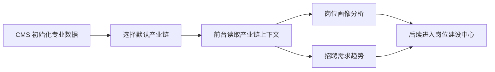

# Demo 总览与演示路径

## Demo 拆解目标

本拆解不是重新设计产品，而是把当前可运行 demo 中已经体现的页面、交互、数据和代码边界拆开，作为 V1.0 一期研发落地的参照。

一期只拆以下 demo 能力：

- CMS 数据初始化
- 岗位画像分析
- 招聘需求趋势

## Demo 入口

| 场景 | 当前入口 | 说明 |
| --- | --- | --- |
| 前台岗位中心 | `major-construction-platform/index.html` | 主 demo 入口，通过顶部/侧边导航进入岗位中心 |
| CMS 初始化 | `major-construction-platform/industry-research-admin.html` | 管理端新专业建设初始化页 |
| 成果页 | `index.html?view=results-portal` | 当前 demo 已有成果展示，不纳入本期开发主范围 |

## 推荐演示顺序

### 1. CMS 初始化

演示目标：说明专业数据从管理端开通，而不是前台凭空展示。

讲解顺序：

1. 进入 CMS 新专业建设页。
2. 展示“待初始化”状态。
3. 点击“数据初始化”。
4. 展示初始化中状态。
5. 展示推荐产业链列表。
6. 选择“智能建造产业链”作为默认产业链。

关键截图：

- `assets/22-cms-init-empty.png`
- `assets/23-cms-chain-recommendations.png`
- `assets/24-cms-chain-selected.png`

### 2. 岗位画像分析

演示目标：说明系统已能把当前专业对应产业链拆成岗位画像。

讲解顺序：

1. 进入岗位中心。
2. 在“产业调研/岗位分析”区域选择“岗位画像分析”。
3. 展示岗位画像洞察和 4 个 KPI。
4. 搜索岗位名称、技能关键词或产业链环节。
5. 按岗位等级筛选。
6. 点击岗位卡片查看岗位画像详情。

关键截图：

- `assets/05-job-portrait.png`
- `assets/06-job-portrait-detail.png`

### 3. 招聘需求趋势

演示目标：说明岗位建设优先级有招聘趋势依据。

讲解顺序：

1. 从岗位画像分析切换到“招聘需求趋势”。
2. 展示近 12 月岗位需求、高频招聘岗位、平均薪资、企业样本。
3. 展示月度趋势图。
4. 展示技能需求热度。
5. 展示热门岗位招聘明细。

关键截图：

- `assets/07-job-demand.png`

## Demo 讲解主线

## Demo 中已有但本期不主做的内容

| Demo 能力 | 本期处理 |
| --- | --- |
| 产业布局、产业链图谱、区域产业分析、政策库、企业库 | 只作为 CMS 默认产业链和岗位分析上下文，不做完整产业调研模块 |
| 新岗位新技术预判 | 暂不生产化，可保留导航或后续入口 |
| 岗位建设中心 | 作为后续承接模块，不纳入本次三模块首批交付 |
| 成果展示页 | 作为演示结果页，不作为本期开发主模块 |
| 课程模型、决策中心、成员等 | 不纳入 V1.0 一期 |

## Demo 到产品的一期落地判断

当前 demo 已经具备“能演示”的页面完整度，但生产化还需要补三类能力：

- 数据持久化：CMS 初始化结果、默认产业链、岗位画像、招聘趋势不能只存在前端 mock。
- 接口化：前台页面需要按专业 ID、产业链 ID、查询条件读取后端数据。
- 状态化：未初始化、初始化中、初始化失败、无岗位数据、无招聘数据都需要明确状态。
