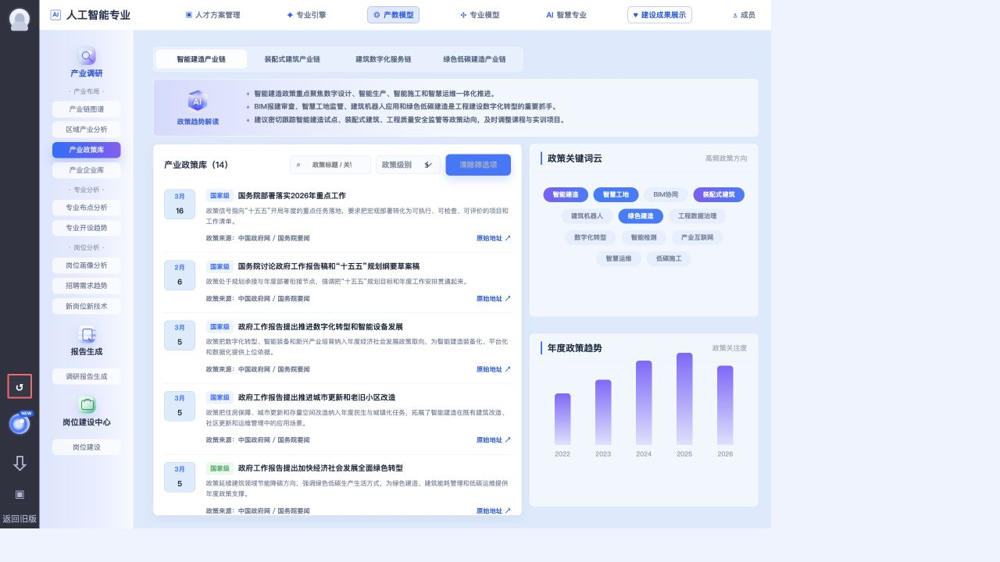

# 政策库 Figma 设计走查

走查日期：2026-07-10  
目标 Figma：`智慧专业（原专业决策）`，页面节点 `2062:80752`  
当前实现：`major-construction-platform` 的 Vue/Vite 入口与 `file://` standalone 入口  
结论：**严格一致性验收不通过；结构接近，但视觉、状态与双入口一致性仍有明确差距。**

## 对照证据

### Figma 默认加载态（选中帧精确尺寸：1440 × 988）

### 当前实现（按 1440 × 988 自然画布重载后的同尺度截图）

### 当前实现 1280 × 720 实际视口

### 搜索结果态

### 政策详情态

## Figma 精确参数

下表来自 Figma Properties 面板的只读实测；背景色一行来自原始 PNG 像素采样。

| 对象 | Figma 规范 |
|---|---|
| 页面加载态根帧 | `1440 × 988`，Horizontal Auto Layout |
| 政策列表标题 | `132 × 26`；PingFang SC；`16/26`；600；`#2B2E35` |
| AI 标题“政策趋势解读” | `84 × 20`；PingFang SC；`14/20`；600；线性渐变 `#3764FF → #A568FF` |
| AI 正文 | 单行测量 `992 × 24`；PingFang SC；`14/24`；400；`#3A4865` |
| 政策标题 | 单行测量 `405 × 20`；PingFang SC；`15/20`；600；`#142346` |
| 政策摘要 | `580 × 52`；PingFang SC；`14/24`；400；`#495D87` |
| 政策条目 Card 1 | Fill `690px`；Hug `141px`；水平布局；上下 `12px`、左右 `8px`；Gap `24px`；`radius-l` |
| 搜索框 | `240 × 32`；`radius-s`；1px 边框；Padding `5 8 5 12`；Gap `8`；背景 `#FFFFFF 80%`；边框 `#103FB7 17%` |
| 搜索占位文字 | 行高 `20px`；400；`#A0ACC5` |
| 政策级别下拉 | `160 × 32`；`radius-s`；1px 边框；Padding `5 12 5 16`；背景、边框同搜索框 |
| 侧栏标题 | `16/22`；600；`#142346` |
| 侧栏副标题 | `14/26`；400；`#7485A8` |
| 背景采样 | 主画布约 `#D6E4FF`；二级导航约 `#E6EFFF`；卡片约 `#F3F7FF`；日期块约 `#DDEBFF` |

## 当前实现参数

| 对象 | 当前实现 |
|---|---|
| 政策画板 | `#DBEAFE`；Padding `14px`；Gap `14px`；Radius `8px` |
| 产业链切换 | 最大宽 `690px`；容器高 `46px`；按钮最小高 `36px` |
| AI 卡 | 高 `108px`；两列 `118px + 1fr`；Gap `32px`；Padding `12 24 16` |
| AI 标题 | `13px`；800；`#2E63D2`，没有 Figma 的渐变文字 |
| AI 正文 | `13px`；700；约 `17.6px` 行高；`#50607B` |
| 政策标题 | `14px`；900；约 `20.3px` 行高；`#17233A` |
| 政策摘要 | `12px`；约 `19.8px` 行高；`#6D7A92` |
| 政策条目 | `64px + 1fr`；Gap `14px`；上下 Padding `14px`；运行时首行约 `132.6px` 高 |
| 搜索 / 下拉 | 外层高 `34px`；搜索列最小 `150px`，下拉最大 `120px`；内部 input/select 被另一组规则设为 `38px` 高 |
| 右侧卡片 | 两行各 `1fr`，但关键词主体最小高 `202px`、趋势图固定高 `205px`，父卡 `overflow:hidden` |
| 趋势图 | 5 根柱（2022–2026）；柱宽 `30px`；无 0/30/60/90/120 轴标签 |

## 最高优先级差异

### P0 — 视觉与布局

1. **工具栏与 Figma 不一致。** Figma 只有标题、`240×32` 搜索框和 `160×32` 下拉；当前多出“清除筛选项”按钮。该按钮还被 `.policy-toolbar button` 的高优先级样式覆盖，禁用态仍是蓝底，实测视觉与 Figma 完全不同。
2. **核心文字层级整体偏小、偏粗、偏紧。** AI 正文应为 `14/24/400`，当前为 `13px/700`；政策标题应为 `15/20/600`，当前为 `14px/900`；摘要应为 `14/24/400`，当前为 `12px`。
3. **侧栏标题符号错误。** Figma 使用蓝色菱形前导图形；当前沿用通用卡头的 3px 竖线。标题字重也从 Figma 600 变成 900。
4. **年度趋势图缺项。** Figma 是 2022–2027 共 6 根柱，并显示 0/30/60/90/120 纵轴；当前只有 5 根柱，无纵轴标度。
5. **矮屏直接裁切。** 在 1280×720 实测中，关键词内容超出父卡 `69px`，趋势图超出父卡 `70px`，父卡又使用 `overflow:hidden`，内容被直接截掉。

### P1 — 状态与交互

1. 四个产业链标签只改变选中状态，政策列表、AI 解读、关键词和趋势数据完全不变。
2. 当前 14 条政策全部是“国家级”，级别筛选只有“全部 / 国家级”，没有真实筛选价值。
3. 搜索“城市更新”后实际剩 2 条，但标题仍显示“产业政策库（14）”。
4. Vue 详情弹窗的“对专业建设的影响”末段重复显示两次。
5. Figma 默认态每条政策卡高 `141px`、Gap `24px`；当前运行时约 `132.6px`、Gap `14px`，列表显得更密。

### P1 — 双入口一致性

1. Vue 左侧二级导航宽 `176px`；standalone 仍使用 `.section-menu` 的 `205px`；Figma 约 `168px`。`file://` 入口偏宽最明显。
2. standalone 搜索每输入一个字符都会通过 `app.innerHTML` 重建整页，输入节点被删除，键盘焦点会丢失。
3. 两套入口分别维护政策数据与模板，后续修改必须同时覆盖 `src/App.vue` 和 `index.html`。

### P1 — 可访问性

1. 搜索框和下拉明确设置 `outline:none`，外层没有 `:focus-within`，键盘焦点不可见。
2. 弹窗没有打开后聚焦、焦点圈定、关闭后归还、Escape 关闭和背景 `inert`。
3. `article role="button"` 内嵌真实链接，形成复合交互控件。
4. 年度趋势图没有数值文本或可访问替代数据。
5. 小字对比度偏低：卡头副标题约 `2.33:1`、趋势年份约 `2.99:1`、普通关键词约 `3.45:1`。

## 已经对得比较好的部分

- 页面总体结构、左列表 + 右双卡的比例、日期块、蓝紫选中态和 8px 圆角方向与 Figma 一致。
- AI 卡高度当前 `108px`，与设计约 `106px` 很接近。
- 政策日期使用 `<time datetime>`；条目支持 Enter/Space；外链使用 `rel="noopener"`。
- Vue 详情弹窗具备 `aria-modal`、`aria-labelledby` 和明确关闭按钮名称。

## 走查步骤健康度

1. **政策库默认态：需整改。** 结构接近，但字体、工具栏、图表和矮屏裁切未达到严格一致。
2. **搜索筛选态：部分通过。** 搜索实际生效；标题数量不更新，清除按钮样式偏离 Figma。
3. **政策详情态：部分通过。** 视觉层级清晰；正文重复，焦点管理与键盘关闭缺失。

## 证据边界

- Figma 结构化接口因文件仅有“查看/评论”权限而拒绝读取；精确参数改由已登录 Chrome 中的 Properties 面板只读取得。
- 已确认根帧、文字、政策条目、搜索框和下拉的精确参数；背景色来自截图像素采样。
- 未宣称完整 WCAG 合规；焦点、语义和对比度结论来自当前截图、浏览器实测与源码审查。
- 本轮为只读走查，没有修改 Vue、CSS、静态 HTML 或数据文件。
