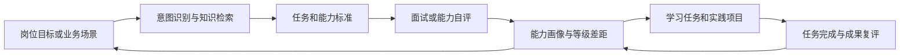

# 计算机视觉岗位成长智能体设计说明

日期：2026-08-18  
状态：已完成产品方向确认，待书面设计确认后进入实施计划  
项目目录：`cv-career-agent`

## 1. 项目目标

建设一个面向比赛展示、可断网独立运行的计算机视觉岗位成长智能体。智能体服务于计算机视觉开发工程师初级、中级、高级三个等级，能够围绕岗位目标和业务场景完成岗位分析、能力检索、等级对比、模拟面试、差距诊断、成长任务规划和成果复评。

产品不是固定步骤的演示向导。推荐演示路线只用于帮助评委快速理解，用户可从任意能力入口发起任务，各模块共享同一岗位上下文和能力画像，形成可持续更新的业务闭环。

## 2. 需求依据与处理原则

### 2.1 需求材料

- `人工智能智能体v1.docx`：提供岗位模块、课程模块和 Agent 能力的原始设想。
- `功能拆解表_计算机视觉开发.xlsx`：共 80 项子功能，岗位模块与课程模块各 40 项。
- `人工智能工程技术人员国家职业技术技能标准（2021年版）.pdf`：作为岗位等级、职业功能、专业能力和知识要求的最高优先级依据。
- `计算机视觉产品实现（初级）.pdf`：用于补充初级需求分析、设计开发、验证、交付和运维知识。
- `计算机视觉产品实现（中级）.pdf`：用于补充中级全流程设计、模型验证、问题定位、运维和技术咨询知识。
- `人工智能基础知识.pdf`：用于补充数学、算法、数据处理、软件工程、计算平台、机器学习、深度学习、安全、法律和伦理知识。
- 参赛视频缩略图：仅用于理解“输入条件—智能处理—可视化诊断”的展示形式。原 MP4 本体当前未在给定路径中找到，因此不作为视觉复刻依据。

### 2.2 来源优先级

1. 国家职业技术技能标准中的明确规定。
2. 初级、中级教材的知识体系和业务流程。
3. 人工智能基础教材的共性知识。
4. Word 和 Excel 中提出的产品功能设想。
5. 为保证演示闭环而构造的场景、用户画像和测评数据。

所有演示数据必须标注为演示数据，不得伪装成国家标准或教材原文。所有岗位能力结论必须能够回到来源文件、章节或页码。

## 3. 已选方案与取舍

### 3.1 方案比较

- 单屏智能工作台：入口集中、模块可跳转、适合投屏，能兼顾成熟度和演示效率。
- 五步向导：叙事清楚，但产品过于线性，无法体现智能体的任务编排能力。
- 综合驾驶舱：信息密度高，但容易与现有教育平台混同，也不利于自然语言任务入口。

采用“单屏多入口智能体工作台”。演示可按推荐路线运行，但产品不强制顺序。

### 3.2 保留能力

- 自然语言任务入口与推荐问题。
- 初级、中级、高级岗位等级上下文。
- 岗位标准检索与典型任务拆解。
- 工作任务—能力项—知识点—证据来源关联。
- 能力图谱、等级雷达和差距诊断。
- 分层模拟面试、条件追问和评分反馈。
- 成长任务规划、任务完成和成果复评。
- 历史会话、报告和当前成长目标的本地保存。

### 3.3 删除能力

- 企业招聘网站自动采集和实时 JD 同步。
- 真实大模型、语音识别、视频分析和在线搜索。
- 心理陪伴及认知负荷实时监测。
- 校内沙箱、云 GPU、代码仓库和数据集的真实挂载。
- 多程序员 Agent 团队、代码自动执行和 CI/CD 实际部署。
- 后台管理、组织权限、账号体系和多租户能力。
- 与现有专业建设 demo 的组件、样式、数据或运行时集成。

## 4. 用户与使用场景

### 4.1 主要用户

- 学生：了解目标等级、参加模拟面试、定位差距并制定成长计划。
- 教师：查看岗位标准如何转化为任务、能力、知识和测评证据。
- 评委：在有限时间内验证智能体是否具有可信知识来源、任务编排能力和业务闭环。

### 4.2 核心业务场景

首版提供五个场景：

1. 工业缺陷检测。
2. 通用目标检测。
3. 图像语义分割。
4. 视频目标追踪与分析。
5. 边缘设备模型部署与优化。

每个场景均定义适用等级、典型任务链、工具链、产出物、质量指标、能力节点和知识依据。

## 5. 业务闭环

闭环规则：

- 岗位分析结果可直接发起面试、生成实践任务或加入成长计划。
- 面试结果必须更新同一份能力画像，并改变匹配度、雷达图和推荐内容。
- 成长任务完成后可进行复评，复评结果再次更新能力画像。
- 用户可追问任一结论的原因，智能体返回评分依据、来源和下一步动作。
- 修改岗位等级或业务场景后，任务、能力权重、面试难度和成长建议同步重算。

## 6. 信息架构与界面

### 6.1 视觉方向

- 深石墨灰为基础背景，电光紫与荧光青为强调色。
- 采用 AI 任务终端和智能工作台语言，不使用现有教育平台的浅色卡片风格。
- 通过细网格、状态光点、工具调用轨迹和层次化数据图形营造技术感。
- 图形和动效服从信息表达，不使用大面积装饰性渐变或无意义动画。

### 6.2 页面结构

应用只有一个主工作台，不设置传统多级侧边栏。

- 顶部上下文栏：产品名称、岗位等级、当前场景、能力匹配度、重置演示。
- 左侧主区域：自然语言对话、推荐问题、工具调用状态和行动按钮。
- 右侧动态工作区：任务链、能力图谱、雷达诊断、成长计划、知识依据和历史报告标签页。
- 底部输入区：自由输入、快捷指令和当前可执行动作。

用户可通过以下入口开始：

- 输入自然语言问题。
- 点击推荐问题。
- 直接打开岗位分析、模拟面试、差距诊断或成长计划。
- 从任务、能力节点、薄弱点或历史报告继续追问。

### 6.3 成熟智能体表现

- 回答结构统一为“依据—结论—下一步动作”。
- 工具调用过程显示当前使用的本地能力，但不伪装在线大模型调用。
- 对同一用户维持岗位等级、场景、能力画像和任务状态。
- 支持解释评分、对比等级、变更目标和重新规划。
- 不识别的输入不会进入死路，而是说明支持范围并给出三个最相关入口。

## 7. 智能体架构

### 7.1 技术选型

- Vue 3
- TypeScript
- Vite
- ECharts
- 浏览器 `localStorage` 持久化演示状态
- Vitest 或 Node 测试脚本验证规则与关键交互

项目拥有独立的 `package.json`、源码、测试和构建产物，不导入现有项目代码。

### 7.2 模块划分

1. `IntentRouter`：识别岗位分析、能力查询、等级对比、模拟面试、差距诊断、成长规划和解释追问。
2. `AgentOrchestrator`：根据意图、岗位上下文和能力画像组合工具调用与回复。
3. `KnowledgeService`：按等级、场景、职业功能和能力节点检索本地知识。
4. `TaskAnalysisTool`：生成典型任务、步骤、工具、产出物和质量指标。
5. `InterviewTool`：选题、条件追问、评分并返回证据。
6. `ProfileTool`：维护能力得分、匹配度、薄弱点和变化记录。
7. `GrowthPlannerTool`：将缺口映射为知识学习和实践任务。
8. `EvidenceTool`：返回来源文件、章节、页码及证据摘要。
9. `SessionStore`：保存当前上下文、历史报告和成长任务。

### 7.3 离线智能策略

自由输入通过中文关键词、同义词和上下文进行意图分类。回复不是单一固定文案，而是由岗位等级、场景、能力权重、历史测评和工具输出共同组装。无法可靠分类时，系统明确说明支持范围，并给出最接近的三项操作。

界面使用短暂等待、逐段输出和工具状态呈现处理过程，但必须在可控时间内完成，不制造长时间假加载。

## 8. 知识库设计

### 8.1 数据规模

- 3 个岗位等级。
- 7 类职业功能。
- 5 个业务场景。
- 50 至 70 个能力与知识节点。
- 18 至 24 道分层面试题。
- 12 个成长实践任务。

### 8.2 数据实体

- `SourceRecord`：来源文件、章节、PDF 页码、印刷页码、来源类型。
- `RoleLevel`：等级定义、重点职业功能、权重和能力阈值。
- `CapabilityNode`：能力名称、类型、等级、前置节点、相关任务和证据。
- `Scenario`：业务目标、典型任务链、工具链、产出物、质量指标。
- `InterviewQuestion`：等级、场景、题型、评分规则、追问条件和能力映射。
- `GrowthTask`：目标能力、学习内容、实践步骤、验收条件和预计提升值。
- `LearnerProfile`：当前得分、薄弱点、测评记录、成长任务和目标等级。

### 8.3 国家标准关键依据

- PDF 第 32 至 33 页：计算机视觉产品实现初级要求。
- PDF 第 34 至 36 页：计算机视觉产品实现中级要求。
- PDF 第 37 至 39 页：计算机视觉产品实现高级要求。
- PDF 第 51 页：计算机视觉产品实现理论知识权重。
- PDF 第 56 页：计算机视觉产品实现专业能力权重。
- PDF 第 58 页：计算机视觉产品实现职业方向定义。

能力权重和等级差异优先按国家标准建立，教材用于扩充任务细节和知识解释。

## 9. 测评与画像更新

### 9.1 面试评分

每道题映射一至三个能力节点，按以下维度评分：

- 概念准确度。
- 业务完整度。
- 工程可执行性。
- 指标与风险意识。

面试总评不直接使用随机数。演示回答匹配评分要点后，根据命中项、缺失项和追问表现计算能力变化。

### 9.2 匹配度

匹配度为当前能力得分与目标等级能力阈值的加权结果。权重来自国家标准中的专业能力权重表，场景相关能力可在总权重不变的前提下进行显示层面的重点标注。

### 9.3 成长复评

成长任务只有在用户完成模拟提交或通过复评问题后才更新能力画像。更新记录包含原始得分、提升原因、证据和时间，用户可以查看变化前后对比。

## 10. 错误处理与边界

- 空输入：提示用户输入目标，并显示推荐问题。
- 无法识别的意图：说明智能体当前支持范围，推荐三个最接近入口。
- 无匹配知识：不编造答案，返回可用的相邻能力或标准条目。
- 本地数据异常：显示可恢复提示并允许重置演示数据。
- 存储不可用：继续以当前会话运行，并提示刷新后状态不会保留。
- 图表渲染失败：退化为文本能力列表和数值，不阻断核心流程。

## 11. 验收标准

### 11.1 功能验收

- 六类核心意图均可通过自然语言和快捷入口触发。
- 任意模块均可独立进入，并可跳转到相关模块。
- 面试、成长任务和复评共享并更新同一能力画像。
- 修改等级或场景后，相关结果同步变化。
- 所有岗位结论均有可打开的知识依据。
- 历史报告、成长目标和当前画像刷新后保留。
- 一键重置能够恢复一致的初始演示状态。

### 11.2 视觉验收

- 1440×900 投屏下核心功能无需横向滚动。
- 主要卡片、图表、对话和底部输入区无重叠、截断或不可读文字。
- 初级、中级、高级在相同能力维度上的差异可清晰辨认。
- 色彩、排版和组件风格与现有专业建设 demo 明显不同。
- 动效不影响快速操作，支持系统减少动态效果设置。

### 11.3 工程验收

- 断网状态下可完成全部核心流程。
- `npm run build` 成功。
- 数据规则、意图路由、画像更新和成长任务闭环有自动化测试。
- 浏览器完成桌面投屏尺寸和窄屏尺寸视觉检查。
- 控制台无未处理异常和持续报错。

## 12. 推荐比赛演示路线

推荐路线不构成产品强制流程：

1. 选择“中级 + 工业缺陷检测”。
2. 输入“请分析这个岗位场景的核心任务和能力要求”。
3. 查看任务链并追问某个能力的标准依据。
4. 从分析结果直接发起模拟面试。
5. 完成三题后查看雷达、匹配度和薄弱点。
6. 将一个薄弱点加入成长计划并完成模拟复评。
7. 展示画像变化、进阶建议和知识来源。

目标演示时长为 3 至 4 分钟，期间所有核心模块仍可从任意入口独立访问。

## 13. 实施边界

首版目标是可信、完整、可解释的离线智能体体验。不会在首版中实现真实大模型、真实教学资源平台或真实代码执行。源码结构应为未来替换真实模型服务、数据库和身份系统预留清晰接口，但不得因未来扩展增加当前界面复杂度。
